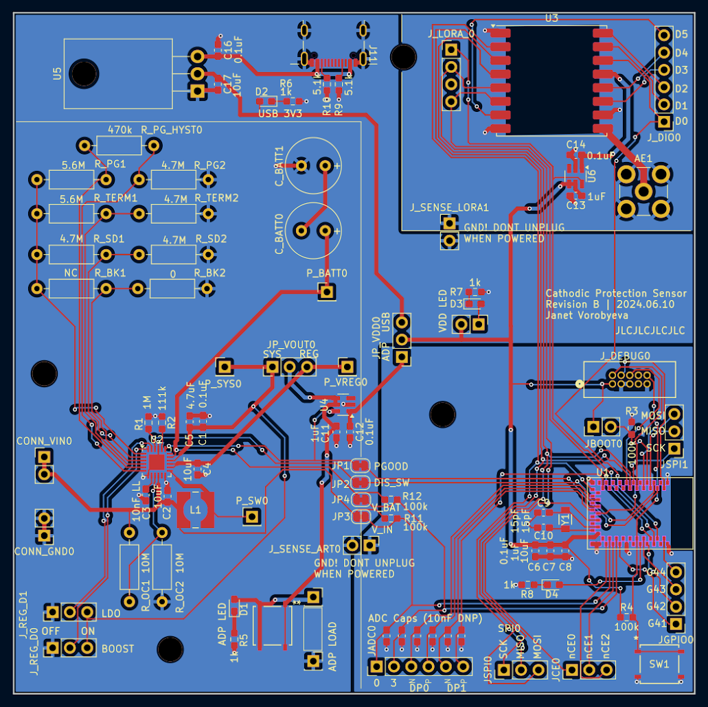

# cpm-hardware

This repo contains the design files for the custom PCB used in my Cathodic Protection Monitoring project.
These were developed in KiCad 8.
(see [main repo](https://github.com/jvorob/cpm-firmware) for more details)

`cpm_proj/` Contains the mk1 board used as of 2024.06.16, a 100x100mm 2-layer PCB.

`cpm_mk2/` is the start of a planned second version, if I get around to miniaturizing and deploying it.

